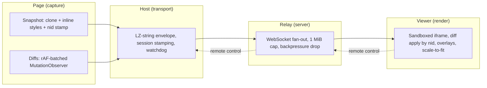

<div align="center">

# PhantomStream

*DOM-native live browser mirroring. A real tab streamed as structured DOM instead of pixels.*

PhantomStream mirrors a live browser tab to a remote viewer as structured DOM data, not video. It sends one style-inlined snapshot and then tiny MutationObserver diffs addressed by stable node IDs, so the viewer gets a live, semantically addressable, remotely controllable copy of the page at a fraction of the bandwidth of screen streaming.


[](https://github.com/fullselfbrowsing/PhantomStream/stargazers)
[](https://github.com/fullselfbrowsing/PhantomStream/issues)
[](https://github.com/fullselfbrowsing/PhantomStream/commits/main)

[The Problem](#the-problem) · [The Solution](#the-solution) · [Why DOM Streaming](#why-dom-streaming-instead-of-video) · [Architecture](#architecture) · [Features](#features) · [Tech Stack](#tech-stack) · [Getting Started](#getting-started) · [Project Structure](#project-structure) · [Documentation](#documentation) · [Roadmap](#roadmap)

</div>

---

## The Problem

When an AI agent drives a browser, the human supervising it needs a live view of what the agent is doing. The obvious tools are video. WebRTC, a CDP screencast, or a sequence of screenshots all send pixels. Pixels are heavy. Every frame costs bandwidth whether the page changed or not, encoding and decoding add latency, and the result is lossy and resolution bound.

Worse, pixels are opaque. The watcher cannot ask which element the agent is touching, cannot highlight a node, cannot annotate the view, and cannot reliably drive the page back. Remote control over a video stream means clicking pixel coordinates against a frame that may already be stale, so a misaligned click lands on the wrong thing.

## The Solution

PhantomStream streams the DOM itself. It captures the page once as a style-inlined snapshot, stamps every element with a stable identifier, and then watches the page with a MutationObserver. From that point on it sends only small diffs (`add`, `rm`, `attr`, `text`) keyed by node ID, batched to the page's own paint cadence. The viewer rebuilds the document inside a sandboxed iframe and applies each diff by ID.

The payoff is a mirror that is cheap, exact, and addressable. Bandwidth tracks how much the page actually changes rather than the frame rate. Text renders natively at any resolution. Remote control targets real elements by their stable IDs instead of guessing at coordinates, so a click on the viewer maps back to the exact node on the source.

PhantomStream began as milestone **v0.9.9.1 "Phantom Stream"** inside [FSB (Full Self-Browsing)](https://github.com/fullselfbrowsing/FSB), where it powers the dashboard's live preview of automated browsing sessions. This repository turns it into three things at once: a standalone plug-and-play framework for anything that needs a live view into a browser it controls, an SDK that FSB can plug back in, and the working repository for an accompanying research paper.

---

## Why DOM Streaming Instead of Video

| | Video / screenshot streaming | PhantomStream (DOM streaming) |
|---|---|---|
| **Bandwidth** | Continuous frames, independent of page content | One snapshot, then tiny diffs only when the page changes |
| **Latency** | Encode, transmit, then decode per frame | A text mutation is one small JSON op |
| **Fidelity** | Lossy and resolution bound | Exact DOM, native text rendering, resolution independent |
| **Remote control** | Pixel coordinates against a possibly stale frame | Real elements addressed by stable node IDs |
| **Inspectability** | Opaque pixels | The mirror *is* a DOM, so it is queryable, highlightable, annotatable |

---

## Architecture

PhantomStream is a four-stage pipeline. The page is captured, the host wraps each message for transport, a relay fans messages out to viewers, and the viewer rebuilds and applies them. Remote control runs the same path in reverse.



Core mechanisms (see [docs/ARCHITECTURE.md](docs/ARCHITECTURE.md) for the full treatment and [docs/SECURITY.md](docs/SECURITY.md) for the embed security contract):

- **Stable node identity.** Every element is stamped with a `data-fsb-nid`. All diff ops and remote-control actions address nodes by this key, so a late diff always lands on the right element.
- **Curated computed-style capture.** Roughly 85 visual-fidelity CSS properties are inlined per element rather than all 300 plus, with default-value elision. This is the fix that took a YouTube serialize from 45 seconds down to interactive.
- **Display-matched diffing.** Mutations batch and flush on `requestAnimationFrame`, so the mirror updates at the same cadence the page paints.
- **Budgeted snapshots.** Snapshots truncate to a relay-safe size by dropping whole subtrees below 3x the viewport, never mid-element, after a single batched layout read.
- **Dual watchdogs.** A capture-side self-watchdog rescues a stuck mutation queue. A second host-side alarm survives service-worker eviction and requests a fresh snapshot if the stream strands silently.
- **Session identity.** Every message carries a `streamSessionId` plus a `snapshotId`. The viewer rejects stale messages, so late diffs from a previous page can never corrupt the mirror.
- **Side channels.** Scroll position, automation overlays (action glow, progress card), and native `alert` / `confirm` / `prompt` dialogs mirror alongside the DOM.

---

## Features

| Feature | Description |
|---|---|
| **Stable node IDs** | Every captured element carries a `data-fsb-nid`. Diffs and remote-control actions address nodes by ID, never by coordinate or fragile selector. |
| **Curated style inlining** | About 85 fidelity-critical CSS properties are inlined per element with default elision, keeping heavy pages interactive instead of stalling on full style enumeration. |
| **Paint-cadence diffs** | A MutationObserver batches changes and flushes on `requestAnimationFrame`, so the wire carries one compact op per real change at the page's own update rate. |
| **Budgeted snapshots** | Snapshots stay under the relay's per-message cap by dropping offscreen subtrees on whole-element boundaries after a single layout read. |
| **Session stamping** | A per-session `streamSessionId` and per-snapshot `snapshotId` ride every message, so the viewer can reject anything from a stale page. |
| **Dual watchdogs** | A capture-side timer and a host-side alarm independently recover a wedged stream by forcing a flush or a fresh snapshot. |
| **Compressed envelope** | Payloads above 1 KB are LZ-string compressed when smaller, carried as a self-identifying `{ _lz: true, d }` envelope that is stateless per frame. |
| **Sandboxed rendering** | The viewer rebuilds the page inside an iframe sandboxed to exactly `allow-same-origin`, never `allow-scripts`, with a CSP meta tag and a post-parse scrub. |
| **Capture-side sanitization** | Serialization strips `on*` handlers, dangerous URL schemes, `srcdoc`, and `object` / `embed` subtrees on the wire clone only. The live page is never touched. |
| **Privacy masking** | `blockSelector`, `maskTextSelector`, `maskInputs`, and custom mask functions redact sensitive content before it leaves the page, with passwords always masked. |
| **Side-channel mirroring** | Scroll, automation overlays, and native dialogs stream alongside the DOM and render as host-document overlays above the mirror. |
| **Playwright adapter** | Drop the capture core into a Playwright or CDP page through a ready-made adapter, including authorized reverse remote control. |
| **Pluggable transport** | Capture, viewer, and relay all talk through a small transport seam, so the same core runs over WebSocket, an in-page loopback channel, or any channel you supply. |

---

## Tech Stack

| Layer | Technology | Why |
|---|---|---|
| **Language** | Plain JavaScript (ES2020+), ES modules, JSDoc types | The capture core injects as a plain script into a content script, `addInitScript`, or a bookmarklet, with no runtime build step |
| **Runtime** | Node.js 18+ (tested on v24) | Native `node:test` runner and the relay server both run on the standard runtime |
| **Transport** | WebSocket (`ws`) plus a self-identifying LZ-string envelope | Backward-compatible with FSB's shipped `{ _lz, d }` wire format, stateless per frame |
| **Rendering** | Sandboxed iframe, host-document overlay layer | Renders attacker-influenced HTML with script execution disabled by construction |
| **Adapters** | Playwright / CDP injection adapter | Mirrors and remotely controls a Playwright-driven page out of the box |
| **Tests** | `node:test`, `jsdom`, a differential oracle against the FSB reference | Verifies behavioral parity with the shipped implementation, not just unit correctness |

---

## Getting Started

PhantomStream is published as `@fullselfbrowsing/phantom-stream` and exposes one subpath per stage.

```bash
npm install @fullselfbrowsing/phantom-stream
```

**Capture a page** (runs in the page context):

```js
import { createCapture } from '@fullselfbrowsing/phantom-stream/capture';
import { createWebSocketTransport } from '@fullselfbrowsing/phantom-stream/transport/websocket';

const transport = createWebSocketTransport({
  url: 'wss://relay.example.com/ws?room=ROOM_KEY&role=source',
  role: 'source'
});

const capture = createCapture({
  transport,
  skipElement: (el) => el.id === 'my-own-overlay' // exclude your own UI
});

capture.start(); // snapshot once, then stream diffs
```

**Mirror it in a viewer** (runs in the remote context):

```js
import { createViewer } from '@fullselfbrowsing/phantom-stream/renderer';
import { createWebSocketTransport } from '@fullselfbrowsing/phantom-stream/transport/websocket';

const transport = createWebSocketTransport({
  url: 'wss://relay.example.com/ws?room=ROOM_KEY&role=viewer',
  role: 'viewer'
});

const viewer = createViewer({
  container: document.getElementById('mirror'),
  transport
});

viewer.on('state', (e) => console.log('viewer is', e.state)); // connecting | live | stale | disconnected
```

**Run a relay** (Node server that fans messages between source and viewers):

```js
import http from 'node:http';
import { createRelay, createWebSocketRelayBackend } from '@fullselfbrowsing/phantom-stream/relay';

const relay = createRelay();                 // routing core: 1 MiB per-message cap, backpressure drop
const server = http.createServer();
createWebSocketRelayBackend({ server, relay, path: '/ws' });
server.listen(8787);
```

Clients join a room by passing `?room=<id>&role=source|viewer` on the connection URL. See `examples/two-tab-demo/server.js` for the full room and role wiring.

**Run the tests and demos** straight from the repository:

```bash
npm test                  # node:test suite plus the differential oracle
npm run demo              # two-tab demo: a source tab mirrored in a viewer tab
npm run demo:playwright   # Playwright drives a page while a viewer mirrors it
npm run example:loopback  # embedded SDK demo: one page mirrors itself in place
```

---

## Project Structure

```text
src/                          The framework
  protocol/                   Wire types, LZ envelope, shared constants, session identity
  capture/                    Page-side snapshot + MutationObserver diff streaming
  renderer/                   Viewer reconstruction: snapshot, diff apply, overlays
  relay/                      Transport-agnostic routing core + WebSocket backend
  transport/websocket.js      Browser-compatible WebSocket transport for both ends
  adapters/                   Playwright / CDP injection adapter
reference/                    Verbatim FSB source, pinned to the shipped commit
  extension/                  Capture content script, ws client, background excerpts
  dashboard/                  FSB viewer implementation
  server/                     FSB relay server
tests/                        Framework tests
  differential/               Oracle-based parity checks against the reference
docs/                         Architecture, security, design history, paper outline
examples/                     Two-tab, Playwright, and loopback demos
bin/phantom-stream.js         CLI entry point for the demos
```

---

## Documentation

| Document | What it covers |
|---|---|
| [docs/ARCHITECTURE.md](docs/ARCHITECTURE.md) | End-to-end technical description of the capture, transport, relay, and renderer pipeline, plus known limitations |
| [docs/SECURITY.md](docs/SECURITY.md) | The embed security contract: threat model, sanitization, masking, CSP, and sandbox guarantees |
| [docs/DESIGN-HISTORY.md](docs/DESIGN-HISTORY.md) | How the system evolved, what failed along the way, and why the current shape won |
| [docs/paper/OUTLINE.md](docs/paper/OUTLINE.md) | Research paper structure and the evaluation plan against video and rrweb baselines |

---

## Roadmap

| Stage | Status |
|---|---|
| Protocol module: wire types, envelope, constants, session identity | Shipped |
| Capture core decoupled from `chrome.runtime` and the FSB namespace | Shipped |
| Renderer decoupled from the FSB dashboard | Shipped |
| Transport-agnostic relay with a pluggable WebSocket backend | Shipped |
| WebSocket transport plus the Playwright / CDP adapter | Shipped |
| Security pipeline: sanitization, sandbox, privacy masking | Shipped |
| Reference demos: two-tab, Playwright, and embedded loopback | Shipped |
| v1 capture enhancements: CSSOM capture mode, computed styles on added nodes, WeakMap node identity, shadow DOM | Planned |
| Evaluation harness: bandwidth, latency, and fidelity against WebRTC, CDP screencast, and rrweb | Planned |
| Research paper draft | Planned |

---

## Research

PhantomStream is also a paper in progress on DOM-native browser mirroring for agentic browsing (see [docs/paper/OUTLINE.md](docs/paper/OUTLINE.md)). The short pitch: when an AI agent drives a browser, the human supervising it needs a live, trustworthy, low-latency view with semantic handles that answer which element the agent is touching, and pixel streaming gives none of that. The evaluation runs PhantomStream against WebRTC, CDP screencast, and rrweb baselines over a frozen site corpus under scripted activity levels.

---

## Provenance & License

Extracted from FSB at commit `867d6f0c` (2026-06-09), with the original milestone design history preserved under `reference/`. Released under the [MIT License](LICENSE), © 2026 Lakshman Turlapati.
